# DFD Level 0 — Context Diagram

## Overview

The Level 0 DFD (Context Diagram) shows the entire IDIG platform as a single process and identifies all external entities that interact with it, along with the high-level data flows between them.

## External Entities

| Entity | Description |
|---|---|
| Student / Mahasiswa | Registered students who book services and submit projects |
| User Publik | Non-student registered public users who book services |
| Lab Admin | Admin who manages orders, content, pricing, and production |
| Warehouse Admin | Admin responsible for material stock and inventory |
| Super Admin | Full-system administrator managing users, roles, and CMS |
| S3 Storage | AWS S3 bucket for file storage (models, photos, proofs, attachments) |
| Email / Notification Server | Sends email verification, payment alerts, and progress notifications |

## Mermaid Diagram

```mermaid
flowchart TD
    %% ── External Entities ─────────────────────────────────────────────────────
    E_Student["🎓 Student / Mahasiswa\n& User Publik"]
    E_LabAdmin["🔬 Lab Admin"]
    E_WareAdmin["📦 Warehouse Admin"]
    E_SuperAdmin["⚙️ Super Admin"]
    E_S3["☁️ S3 Storage"]
    E_Email["📧 Email / Notification\nServer"]

    %% ── Central System ────────────────────────────────────────────────────────
    SYSTEM(("🏛\nIGDIG Platform\nDigital Health Lab ITS"))

    %% ── Student / User Publik ↔ System ───────────────────────────────────────
    E_Student -->|"Registration / Login data"| SYSTEM
    E_Student -->|"Service booking request\n(brief, files, material pref)"| SYSTEM
    E_Student -->|"Open-source project submission"| SYSTEM
    E_Student -->|"Training registration"| SYSTEM
    E_Student -->|"Payment proof upload"| SYSTEM
    E_Student -->|"Chat messages"| SYSTEM

    SYSTEM -->|"Session token / dashboard"| E_Student
    SYSTEM -->|"Order confirmation & status"| E_Student
    SYSTEM -->|"Production progress updates"| E_Student
    SYSTEM -->|"Payment verification result"| E_Student
    SYSTEM -->|"Project validation result"| E_Student
    SYSTEM -->|"Training confirmation"| E_Student

    %% ── Lab Admin ↔ System ───────────────────────────────────────────────────
    E_LabAdmin -->|"Login / role switch"| SYSTEM
    E_LabAdmin -->|"Order review decisions"| SYSTEM
    E_LabAdmin -->|"Slicer metrics & pricing"| SYSTEM
    E_LabAdmin -->|"Progress updates & status changes"| SYSTEM
    E_LabAdmin -->|"Payment verification"| SYSTEM
    E_LabAdmin -->|"Content CRUD\n(services, events, publications)"| SYSTEM
    E_LabAdmin -->|"Project validation"| SYSTEM

    SYSTEM -->|"Order list & booking details"| E_LabAdmin
    SYSTEM -->|"Revenue reports"| E_LabAdmin
    SYSTEM -->|"Incoming notifications"| E_LabAdmin

    %% ── Warehouse Admin ↔ System ─────────────────────────────────────────────
    E_WareAdmin -->|"Login / role switch"| SYSTEM
    E_WareAdmin -->|"Material verification / flag"| SYSTEM
    E_WareAdmin -->|"Restock entries\n(qty, color, lab, proof)"| SYSTEM
    E_WareAdmin -->|"Tool management"| SYSTEM
    E_WareAdmin -->|"QR scan lookup"| SYSTEM

    SYSTEM -->|"Orders awaiting material check"| E_WareAdmin
    SYSTEM -->|"Current stock levels"| E_WareAdmin
    SYSTEM -->|"Inventory & movement reports"| E_WareAdmin

    %% ── Super Admin ↔ System ─────────────────────────────────────────────────
    E_SuperAdmin -->|"User & role management"| SYSTEM
    E_SuperAdmin -->|"CMS content updates"| SYSTEM
    E_SuperAdmin -->|"Landing page sections"| SYSTEM

    SYSTEM -->|"User list & system state"| E_SuperAdmin
    SYSTEM -->|"Financial & audit reports"| E_SuperAdmin

    %% ── S3 Storage ↔ System ──────────────────────────────────────────────────
    SYSTEM -->|"File upload requests\n(pre-signed URLs)"| E_S3
    E_S3 -->|"File confirmations & paths"| SYSTEM

    %% ── Email / Notification ↔ System ────────────────────────────────────────
    SYSTEM -->|"Verification emails\nPayment & progress alerts"| E_Email
    E_Email -->|"Delivery confirmations"| SYSTEM

    %% ── Styles ───────────────────────────────────────────────────────────────
    classDef external fill:#2d3748,stroke:#4a5568,color:#e2e8f0,font-weight:bold
    classDef system fill:#2b6cb0,stroke:#2c5282,color:#fff,font-size:18px,font-weight:bold

    class E_Student,E_LabAdmin,E_WareAdmin,E_SuperAdmin,E_S3,E_Email external
    class SYSTEM system
```

## Data Flow Summary

### Inbound Flows (to System)
| Source | Data |
|---|---|
| Student | Registration, booking requests, project files, payment proofs, chat |
| Lab Admin | Status decisions, slicer metrics, prices, progress notes, content updates |
| Warehouse Admin | Material verifications/flags, restock entries, QR scans |
| Super Admin | User/role data, CMS content |
| S3 | File paths after direct upload |

### Outbound Flows (from System)
| Destination | Data |
|---|---|
| Student | Confirmations, progress notifications, payment status |
| Lab Admin | Order queue, booking details, reports |
| Warehouse Admin | Orders awaiting material check, stock levels |
| Super Admin | User lists, audit logs |
| S3 | Pre-signed URL requests |
| Email Server | Verification, payment, and progress emails |
