# DFD Level 1 — Decomposed System Diagram

## Overview

Level 1 decomposes the IDIG platform into **7 major processes**, each backed by specific data stores. Notation:
- `[Entity]` — External entity (rectangle)
- `((Process))` — Process (circle)
- `[(Store)]` — Data store (cylinder)

## Booking Status Pipeline

```
review_brief → check_material → slicing → set_price → awaiting_dp → printing → finishing → final_payment → completed
               ↑ warehouse gate                        ↑ DP payment gate
```

## Process Inventory

| # | Process | Key Actions |
|---|---|---|
| 1.0 | Auth & User Management | Register, login, verify email, update profile, switch role, user CRUD |
| 2.0 | Service Booking | Create booking, review brief, status transitions |
| 3.0 | Warehouse Verification | Verify material, flag shortage, record stock movement |
| 4.0 | Production Management | Slicer metrics, progress updates, material deduction |
| 5.0 | Payment Processing | Create termins, upload proof, verify, DP gate |
| 6.0 | Training & Events | Training CRUD, registration, event/team management |
| 7.0 | Content Management | Open-source projects, publications, products |

## Mermaid Diagram

```mermaid
flowchart TD
    %% ── External Entities ─────────────────────────────────────────────────────
    E_Student["🎓 Student /\nUser Publik"]
    E_LabAdmin["🔬 Lab Admin"]
    E_WareAdmin["📦 Warehouse Admin"]
    E_SuperAdmin["⚙️ Super Admin"]
    E_S3["☁️ S3 Storage"]

    %% ── Processes ─────────────────────────────────────────────────────────────
    P1(["1.0\nAuth &\nUser Mgmt"])
    P2(["2.0\nService\nBooking"])
    P3(["3.0\nWarehouse\nVerification"])
    P4(["4.0\nProduction\nManagement"])
    P5(["5.0\nPayment\nProcessing"])
    P6(["6.0\nTraining &\nEvents"])
    P7(["7.0\nContent\nManagement"])

    %% ── Data Stores ───────────────────────────────────────────────────────────
    DS1[("D1 · Users &\nProfiles")]
    DS2[("D2 · Service\nBookings")]
    DS3[("D3 · Transactions\n& Payments")]
    DS4[("D4 · Inventory &\nMaterials")]
    DS5[("D5 · Trainings &\nRegistrations")]
    DS6[("D6 · Projects &\nEvents")]
    DS7[("D7 · Content\n(Pubs, Products)")]

    %% ── 1.0 Auth & User Management ───────────────────────────────────────────
    E_Student -->|"Register / Login"| P1
    E_LabAdmin -->|"Admin login"| P1
    E_WareAdmin -->|"Admin login"| P1
    E_SuperAdmin -->|"User CRUD,\nRole assign"| P1
    P1 -->|"Session token"| E_Student
    P1 <-->|"User records"| DS1

    %% ── 2.0 Service Booking ──────────────────────────────────────────────────
    E_Student -->|"Booking request\n(brief, files, prefs)"| P2
    P2 -->|"Order confirmation"| E_Student
    P2 -->|"New order alert"| E_LabAdmin
    P2 <-->|"Booking records"| DS2
    P2 -->|"Transaction created"| DS3
    E_LabAdmin -->|"Review brief /\ncancel order"| P2
    P2 -->|"Material check\nrequired"| P3

    %% ── 3.0 Warehouse Verification ───────────────────────────────────────────
    E_WareAdmin -->|"Verify or\nflag material"| P3
    P3 <-->|"Booking material\nstatus"| DS2
    P3 <-->|"Stock levels"| DS4
    P3 -->|"Verified → proceed\nalert"| E_LabAdmin
    P3 -->|"Flagged →\nshortage alert"| E_LabAdmin
    E_WareAdmin -->|"Restock entry\n(qty, color, lab)"| P3
    P3 -->|"Stock movement\nrecords"| DS4
    P3 <-->|"Proof upload"| E_S3

    %% ── 4.0 Production Management ────────────────────────────────────────────
    E_LabAdmin -->|"Slicer metrics\n(weight, time)"| P4
    E_LabAdmin -->|"Progress update\n(status, %, notes)"| P4
    E_WareAdmin -->|"Material deduction\n(qty used)"| P4
    P4 <-->|"Booking & progress\nrecords"| DS2
    P4 -->|"Material deduction"| DS4
    P4 -->|"Progress notification"| E_Student
    P4 <-->|"Attachment upload"| E_S3
    P3 -->|"Material verified\n→ unblock"| P4

    %% ── 5.0 Payment Processing ───────────────────────────────────────────────
    E_LabAdmin -->|"Set price →\ncreate DP termin"| P5
    E_LabAdmin -->|"Verify payment"| P5
    E_Student -->|"Upload\npayment proof"| P5
    P5 <-->|"Payment records"| DS3
    P5 <-->|"Booking payment\nstatus"| DS2
    P5 -->|"Payment status\nnotification"| E_Student
    P5 <-->|"Proof upload"| E_S3
    P5 -->|"DP verified →\nproduction unlock"| P4

    %% ── 6.0 Training & Events ────────────────────────────────────────────────
    E_Student -->|"Training registration\n& payment proof"| P6
    E_LabAdmin -->|"Create / manage training\nManage events & teams"| P6
    P6 <-->|"Training & registration\nrecords"| DS5
    P6 <-->|"Event & team\nrecords"| DS6
    P6 -->|"Registration\nconfirmation"| E_Student

    %% ── 7.0 Content Management ───────────────────────────────────────────────
    E_Student -->|"Submit / edit\nproject"| P7
    E_LabAdmin -->|"Validate project\nManage pubs & products"| P7
    P7 <-->|"Project records"| DS6
    P7 <-->|"Publication &\nproduct records"| DS7
    P7 -->|"Validation result"| E_Student
    P7 <-->|"File / asset\nupload"| E_S3

    %% ── Styles ───────────────────────────────────────────────────────────────
    classDef external fill:#2d3748,stroke:#718096,color:#e2e8f0,font-weight:bold
    classDef process fill:#2b6cb0,stroke:#2c5282,color:#fff,font-weight:bold
    classDef datastore fill:#276749,stroke:#2f855a,color:#f0fff4,font-weight:bold
    classDef storage fill:#553c9a,stroke:#44337a,color:#faf5ff,font-weight:bold

    class E_Student,E_LabAdmin,E_WareAdmin,E_SuperAdmin external
    class E_S3 storage
    class P1,P2,P3,P4,P5,P6,P7 process
    class DS1,DS2,DS3,DS4,DS5,DS6,DS7 datastore
```



## Data Store Details

| Store | Tables |
|---|---|
| D1 · Users & Profiles | `users`, `user_profiles`, `roles`, `user_roles` |
| D2 · Service Bookings | `service_bookings`, `service_progress_updates`, `booking_messages` |
| D3 · Transactions & Payments | `transactions`, `booking_payments` |
| D4 · Inventory & Materials | `raw_materials`, `item_stocks`, `raw_material_movements`, `tools`, `inventories`, `reimbursements`, `labs`, `brands`, `colors` |
| D5 · Trainings & Registrations | `trainings`, `training_registrations` |
| D6 · Projects & Events | `open_source_projects`, `events`, `teams`, `team_members`, `projects` |
| D7 · Content | `publications`, `products`, `services`, `attachments` |

## Critical Business Rules Represented

1. **Warehouse Gate (P3 → P4):** Order cannot advance past `check_material` until warehouse verifies or flags material.
2. **DP Payment Gate (P5 → P4):** Production (`printing` stage) cannot begin until the 30% Down Payment termin is verified.
3. **Production Lock:** Once in `printing` or beyond, booking cannot be cancelled.
4. **Atomic Restock (P3 → D4):** Restock creates Reimbursement + Attachment + ItemStock + RawMaterialMovement in a single DB transaction.
