# Entity Relationship Diagram (ERD)

## Domain Groups

| Domain | Tables |
|---|---|
| Authentication | roles, users, user_profiles, user_roles |
| Service Booking | services, transactions, service_bookings, booking_payments, booking_messages, service_progress_updates |
| Inventory | labs, material_categories, brands, colors, brand_colors, filament_types, raw_materials, item_stocks, raw_material_movements, reimbursements, tools, inventories, inventory_usages |
| Training & Events | trainings, training_registrations, events, teams, team_members, projects |
| Content | open_source_projects, publications, products |
| Lab Team & CMS | lab_team_sections, lab_team_people, structural_members |
| Polymorphic / Audit | attachments, activity_logs, issue_reports, notifications |

## Mermaid ERD

```mermaid
erDiagram

    %% ─── Authentication & Users ──────────────────────────────────────────────

    roles {
        bigint id PK
        string name
    }

    users {
        bigint id PK
        string name
        string email UK
        string password
        bigint role_id FK
        string profile_photo
        string locale
        string timezone
        json preferences
        timestamp email_verified_at
        boolean is_active
    }

    user_profiles {
        bigint user_id PK
        string full_name
        string phone
        text address
        string nik
        string nim
        string department
        string faculty
        string university
    }

    user_roles {
        bigint user_id PK
        bigint role_id PK
    }

    roles ||--o{ users : "primary role of"
    users ||--|| user_profiles : "has one"
    users }o--o{ user_roles : "assigned to"
    roles }o--o{ user_roles : "used in"

    %% ─── Services & Bookings ─────────────────────────────────────────────────

    services {
        bigint id PK
        string name
        string service_type
        text description
        integer base_price
        string whatsapp_number
    }

    transactions {
        bigint id PK
        bigint user_id FK
        integer total_amount
        string payment_status
        timestamp expired_at
    }

    service_bookings {
        bigint id PK
        bigint transaction_id FK
        bigint user_id FK
        bigint service_id FK
        bigint product_reference_id FK
        text brief_description
        string reference_photo_path
        string model_file_path
        string material_preference
        string filament_width
        string scan_purpose
        json object_dimensions
        integer slicer_weight_grams
        integer slicer_print_time_minutes
        integer agreed_price
        string current_status
        timestamp material_verified_at
        bigint material_verified_by FK
        timestamp material_flagged_at
        text material_flag_note
    }

    booking_payments {
        bigint id PK
        bigint service_booking_id FK
        integer amount
        string termin_name
        string status
        string payment_proof
        timestamp paid_at
        bigint verified_by FK
    }

    booking_messages {
        bigint id PK
        bigint service_booking_id FK
        bigint sender_id FK
        text body
        timestamp read_at
    }

    service_progress_updates {
        bigint id PK
        bigint service_booking_id FK
        string status_label
        integer percentage
        text notes
        bigint updated_by FK
    }

    users ||--o{ transactions : "places"
    transactions ||--o{ service_bookings : "covers"
    users ||--o{ service_bookings : "created by"
    services ||--o{ service_bookings : "ordered as"
    service_bookings ||--o{ booking_payments : "has termins"
    service_bookings ||--o{ booking_messages : "has chat"
    service_bookings ||--o{ service_progress_updates : "tracked by"
    users ||--o{ booking_messages : "sends"
    users ||--o{ service_progress_updates : "updated by"
    users ||--o{ booking_payments : "verified by"

    %% ─── Inventory ───────────────────────────────────────────────────────────

    labs {
        bigint id PK
        string name UK
    }

    material_categories {
        bigint id PK
        string name UK
    }

    brands {
        bigint id PK
        string name UK
        bigint material_category_id FK
    }

    colors {
        bigint id PK
        string name UK
        string hex
    }

    brand_colors {
        bigint brand_id PK
        bigint color_id PK
    }

    filament_types {
        bigint id PK
        string code UK
        string name
        string scientific_name
        integer price_per_gram
        boolean is_active
    }

    raw_materials {
        bigint id PK
        bigint brand_id FK
        string name
        string unit
        string unique_code UK
        bigint created_by FK
    }

    item_stocks {
        bigint id PK
        bigint raw_material_id FK
        bigint color_id FK
        bigint lab_id FK
        integer quantity
    }

    raw_material_movements {
        bigint id PK
        bigint raw_material_id FK
        string type
        integer quantity
        bigint service_booking_id FK
        bigint reimbursement_id FK
        bigint progress_update_id FK
        text notes
        bigint created_by FK
    }

    reimbursements {
        bigint id PK
        bigint user_id FK
        string title
        integer total_amount
        string status
    }

    tools {
        bigint id PK
        string name
        string unique_code UK
        bigint lab_id FK
        bigint created_by FK
    }

    inventories {
        bigint id PK
        bigint lab_id FK
        string name
        bigint brand_id FK
        integer total_quantity
        integer available_quantity
    }

    inventory_usages {
        bigint id PK
        bigint inventory_id FK
        bigint user_id FK
        bigint service_booking_id FK
        timestamp started_at
        timestamp ended_at
    }

    material_categories ||--o{ brands : "classifies"
    brands }o--o{ brand_colors : "available in"
    colors }o--o{ brand_colors : "used for"
    brands ||--o{ raw_materials : "categorized by"
    raw_materials ||--o{ item_stocks : "stocked as"
    item_stocks }o--|| colors : "color variant"
    item_stocks }o--|| labs : "stored in"
    raw_materials ||--o{ raw_material_movements : "tracked by"
    reimbursements ||--o{ raw_material_movements : "finances"
    users ||--o{ reimbursements : "submits"
    service_bookings ||--o{ raw_material_movements : "triggers"
    tools }o--|| labs : "belongs to"
    tools }o--|| users : "created by"
    labs ||--o{ inventories : "stores"
    inventories ||--o{ inventory_usages : "used in"
    users ||--o{ inventory_usages : "checked out by"
    service_bookings ||--o{ inventory_usages : "context"

    %% ─── Trainings ───────────────────────────────────────────────────────────

    trainings {
        bigint id PK
        string title
        string slug UK
        integer price
        boolean is_paid
        boolean is_active
        boolean is_featured
        timestamp date
        string location
        integer max_participants
        string instructor_name
        json what_you_will_learn
        json curriculum
    }

    training_registrations {
        bigint id PK
        bigint training_id FK
        bigint user_id FK
        string full_name
        string email
        string phone_number
        string status
        string payment_status
        string payment_proof
        bigint verified_by FK
    }

    trainings ||--o{ training_registrations : "registered in"
    users ||--o{ training_registrations : "registers"

    %% ─── Events & Projects ───────────────────────────────────────────────────

    events {
        bigint id PK
        string name
        integer year
        string theme_title
        boolean is_active
    }

    teams {
        bigint id PK
        bigint event_id FK
        string name
        string course_name
    }

    team_members {
        bigint team_id PK
        bigint user_id PK
        string role_in_team
    }

    projects {
        bigint id PK
        bigint team_id FK
        string title
        string category
        string status
        bigint validated_by FK
    }

    events ||--o{ teams : "contains"
    teams ||--o{ team_members : "has members"
    users }o--o{ team_members : "member of"
    teams ||--o{ projects : "produces"
    users ||--o{ projects : "validated by"

    %% ─── Open-Source Projects & Content ──────────────────────────────────────

    open_source_projects {
        bigint id PK
        bigint user_id FK
        string title
        string slug UK
        string caption
        string category
        string listing_type
        string status
        bigint validated_by FK
        json description
        string license
        string version
        string format
    }

    publications {
        bigint id PK
        string title
        string slug UK
        string author
        string category
        text abstract
        string doi
        string journal
        string pmid
        integer view_count
        boolean is_free_access
        boolean is_featured
        timestamp published_at
    }

    products {
        bigint id PK
        bigint creator_id FK
        string name
        text description
        integer price_min
        integer price_max
        boolean is_active
    }

    users ||--o{ open_source_projects : "submits"
    users ||--o{ products : "creates"

    %% ─── Lab Team & CMS ──────────────────────────────────────────────────────

    lab_team_sections {
        bigint id PK
        string label_id
        string label_en
        integer sort_order
        boolean is_active
    }

    lab_team_people {
        bigint id PK
        bigint section_id FK
        string name_full
        string slug UK
        boolean is_leader
        string role_id
        text bio
        string email
        json expertise
        json education
        boolean is_active
    }

    structural_members {
        bigint id PK
        bigint user_id FK
        string name
        string position
        integer display_order
        boolean is_active
    }

    lab_team_sections ||--o{ lab_team_people : "contains"
    users ||--o{ structural_members : "referenced as"

    %% ─── Polymorphic / Audit ─────────────────────────────────────────────────

    attachments {
        bigint id PK
        string attachable_type
        bigint attachable_id
        string file_url
        string file_type
        boolean is_primary
        integer sort_order
        bigint uploaded_by FK
    }

    activity_logs {
        bigint id PK
        bigint user_id FK
        string action
        string loggable_type
        bigint loggable_id
        json old_data
        json new_data
        string ip_address
    }

    issue_reports {
        bigint id PK
        bigint reporter_id FK
        string reportable_type
        bigint reportable_id
        string type
        text description
        string status
        text resolution_note
        bigint resolved_by FK
        timestamp resolved_at
    }

    notifications {
        string id PK
        string type
        string notifiable_type
        bigint notifiable_id
        text data
        timestamp read_at
    }

    users ||--o{ attachments : "uploads"
    users ||--o{ activity_logs : "performs"
    users ||--o{ issue_reports : "reports"
```

## Relationship Notes

| Relationship | Cardinality | Notes |
|---|---|---|
| `users` → `user_profiles` | 1 : 1 | Profile auto-created; user_id is PK |
| `users` ↔ `roles` | M : N | Via `user_roles`; primary role also stored as `role_id` FK |
| `service_bookings` → `item_stocks` | Indirect | Via `raw_material_movements` + `item_stocks` deduction |
| `item_stocks` | Three-way | Unique on `(raw_material_id, color_id, lab_id)` |
| `attachments` | Polymorphic | `attachable_type` + `attachable_id` → Service, Tool, OpenSourceProject, etc. |
| `issue_reports` | Polymorphic | `reportable_type` → Tool, RawMaterial, or Inventory (nullable for free-form) |
| `notifications` | Polymorphic | `notifiable_type` → User |
| `activity_logs` | Polymorphic | All models using `RecordsActivity` trait |
