# Use Case Diagram — IDIG Platform

## Actors

| Actor | Role |
|---|---|
| Guest | Unauthenticated visitor |
| Mahasiswa / Student | Registered student user |
| User Publik | Registered public (non-student) user |
| Lab Admin | Lab operations administrator |
| Warehouse Admin (admin_gudang) | Warehouse / inventory administrator |
| Super Admin | Full-access system administrator |

## Mermaid Diagram

```mermaid
flowchart LR
    %% ── Actors ────────────────────────────────────────────────────────────────
    Guest(["👤 Guest"])
    Student(["🎓 Mahasiswa"])
    UserPub(["🙍 User Publik"])
    LabAdmin(["🔬 Lab Admin"])
    WareAdmin(["📦 Warehouse Admin"])
    SuperAdmin(["⚙️ Super Admin"])

    subgraph SYSTEM["◈ IDIG Platform — System Boundary"]

        subgraph PUB["Public Content (No Auth)"]
            UC_browse(("Browse\nServices"))
            UC_viewPub(("View\nPublications"))
            UC_viewProj(("View\nProjects"))
            UC_viewProd(("View\nProducts"))
            UC_viewTrain(("View\nTrainings"))
            UC_viewTeam(("View\nTeam Members"))
        end

        subgraph AUTH["Auth & Profile"]
            UC_register(("Register"))
            UC_login(("Login / Logout"))
            UC_verifyEmail(("Verify Email"))
            UC_updateProf(("Update Profile"))
            UC_switchRole(("Switch Role"))
        end

        subgraph BOOK["Service Booking"]
            UC_bookSvc(("Book Service"))
            UC_viewOrder(("View Order\nDetail"))
            UC_uploadProof(("Upload\nPayment Proof"))
            UC_sendMsg(("Send Chat\nMessage"))
        end

        subgraph OSP["Open-Source Projects"]
            UC_submitProj(("Submit Project"))
            UC_editProj(("Edit Project"))
            UC_deleteProj(("Delete Project"))
        end

        subgraph TRAINREG["Training Registration"]
            UC_regTrain(("Register for\nTraining"))
            UC_uploadTrainProof(("Upload Training\nPayment Proof"))
        end

        subgraph LAB_O["Lab Admin – Order Center"]
            UC_reviewBrief(("Review Order\nBrief"))
            UC_setMetrics(("Set Slicer\nMetrics"))
            UC_setPrice(("Set &\nAgree Price"))
            UC_addProgress(("Add Progress\nUpdate"))
            UC_verifyPay(("Verify Payment"))
            UC_addTermin(("Add Payment\nTermin"))
            UC_chatCust(("Chat with\nCustomer"))
        end

        subgraph LAB_C["Lab Admin – Content & Reports"]
            UC_mgmtSvc(("Manage\nServices"))
            UC_mgmtProd(("Manage\nProducts"))
            UC_mgmtEvent(("Manage Events\n& Teams"))
            UC_mgmtPub(("Manage\nPublications"))
            UC_mgmtTrain(("Manage\nTrainings"))
            UC_validateProj(("Validate\nProjects"))
            UC_viewRpt(("View Reports"))
            UC_printQR(("Print QR Label"))
        end

        subgraph WARE_O["Warehouse Admin – Operations"]
            UC_viewIncoming(("View Incoming\nOrders"))
            UC_verifyMat(("Verify Material\nAvailability"))
            UC_flagMat(("Flag Material\nUnavailable"))
            UC_mgmtMat(("Manage Raw\nMaterials"))
            UC_restockMat(("Restock\nMaterial"))
            UC_mgmtTools(("Manage Tools"))
            UC_scanQR(("Scan QR\nCodes"))
        end

        subgraph SUPER_O["Super Admin – System"]
            UC_mgmtUsers(("Manage Users\n& Roles"))
            UC_mgmtCMS(("Manage CMS\nContent"))
            UC_mgmtLanding(("Manage Landing\nSections"))
        end

    end

    %% ── Guest ────────────────────────────────────────────────────────────────
    Guest --> UC_browse & UC_viewPub & UC_viewProj & UC_viewProd & UC_viewTrain & UC_viewTeam
    Guest --> UC_register & UC_login

    %% ── Mahasiswa ────────────────────────────────────────────────────────────
    Student --> UC_browse & UC_viewPub & UC_viewProj & UC_viewProd & UC_viewTrain
    Student --> UC_login & UC_verifyEmail & UC_updateProf & UC_switchRole
    Student --> UC_bookSvc & UC_viewOrder & UC_uploadProof & UC_sendMsg
    Student --> UC_submitProj & UC_editProj & UC_deleteProj
    Student --> UC_regTrain & UC_uploadTrainProof

    %% ── User Publik ──────────────────────────────────────────────────────────
    UserPub --> UC_browse & UC_viewPub & UC_viewProj & UC_viewProd & UC_viewTrain
    UserPub --> UC_login & UC_updateProf
    UserPub --> UC_bookSvc & UC_viewOrder & UC_uploadProof & UC_sendMsg

    %% ── Lab Admin ────────────────────────────────────────────────────────────
    LabAdmin --> UC_login & UC_switchRole
    LabAdmin --> UC_reviewBrief & UC_setMetrics & UC_setPrice
    LabAdmin --> UC_addProgress & UC_verifyPay & UC_addTermin & UC_chatCust
    LabAdmin --> UC_mgmtSvc & UC_mgmtProd & UC_mgmtEvent
    LabAdmin --> UC_mgmtPub & UC_mgmtTrain & UC_validateProj & UC_viewRpt & UC_printQR

    %% ── Warehouse Admin ──────────────────────────────────────────────────────
    WareAdmin --> UC_login & UC_switchRole
    WareAdmin --> UC_viewIncoming & UC_verifyMat & UC_flagMat
    WareAdmin --> UC_mgmtMat & UC_restockMat & UC_mgmtTools & UC_scanQR
    WareAdmin --> UC_viewRpt & UC_printQR

    %% ── Super Admin ──────────────────────────────────────────────────────────
    SuperAdmin --> UC_mgmtUsers & UC_mgmtCMS & UC_mgmtLanding
    SuperAdmin --> UC_reviewBrief & UC_viewIncoming & UC_viewRpt
    SuperAdmin --> UC_mgmtMat & UC_printQR & UC_verifyPay

    %% ── Styles ───────────────────────────────────────────────────────────────
    classDef actor fill:#1a202c,stroke:#4299e1,color:#fff,font-weight:bold,rx:8
    classDef pubUC fill:#ebf8ff,stroke:#3182ce,color:#1a365d
    classDef authUC fill:#f0fff4,stroke:#38a169,color:#1c4532
    classDef userUC fill:#fffaf0,stroke:#d69e2e,color:#7b341e
    classDef labUC fill:#faf5ff,stroke:#805ad5,color:#44337a
    classDef wareUC fill:#fff5f5,stroke:#e53e3e,color:#742a2a
    classDef superUC fill:#ebf4ff,stroke:#4c51bf,color:#3c366b

    class Guest,Student,UserPub,LabAdmin,WareAdmin,SuperAdmin actor
    class UC_browse,UC_viewPub,UC_viewProj,UC_viewProd,UC_viewTrain,UC_viewTeam pubUC
    class UC_register,UC_login,UC_verifyEmail,UC_updateProf,UC_switchRole authUC
    class UC_bookSvc,UC_viewOrder,UC_uploadProof,UC_sendMsg,UC_submitProj,UC_editProj,UC_deleteProj,UC_regTrain,UC_uploadTrainProof userUC
    class UC_reviewBrief,UC_setMetrics,UC_setPrice,UC_addProgress,UC_verifyPay,UC_addTermin,UC_chatCust,UC_mgmtSvc,UC_mgmtProd,UC_mgmtEvent,UC_mgmtPub,UC_mgmtTrain,UC_validateProj,UC_viewRpt,UC_printQR labUC
    class UC_viewIncoming,UC_verifyMat,UC_flagMat,UC_mgmtMat,UC_restockMat,UC_mgmtTools,UC_scanQR wareUC
    class UC_mgmtUsers,UC_mgmtCMS,UC_mgmtLanding superUC
```

## Use Case Descriptions

### Public / Student
- **Book Service** — Student submits a service request with brief, reference photos, 3D model file, and material preference.
- **View Order Detail** — Track booking status, progress timeline, chat history, and payment termins.
- **Upload Payment Proof** — Upload proof image for an outstanding payment termin; status becomes `awaiting_verification`.
- **Submit Project** — Submit an open-source project (3D model, IoT, medical device, software) for admin approval.

### Lab Admin
- **Review Order Brief** — Inspect incoming booking details and move order from `review_brief` → `check_material`.
- **Set Slicer Metrics** — Enter weight (grams) and print time (minutes) after slicing the 3D model.
- **Set & Agree Price** — Set final agreed price; system auto-creates a mandatory 30% DP termin.
- **Add Progress Update** — Record production stage with percentage, notes, and optional photos; triggers customer notification.
- **Verify Payment** — Mark a payment termin as paid; verifying the DP unlocks the `printing` stage.

### Warehouse Admin
- **View Incoming Orders** — See orders in `check_material` stage awaiting material verification.
- **Verify Material** — Confirm stock is available; clears any existing flag and allows order to proceed.
- **Flag Material Unavailable** — Record a shortage note; blocks the order from proceeding until resolved.
- **Restock Material** — Add incoming stock (by color/lab/quantity) with a reimbursement proof; atomic transaction.
